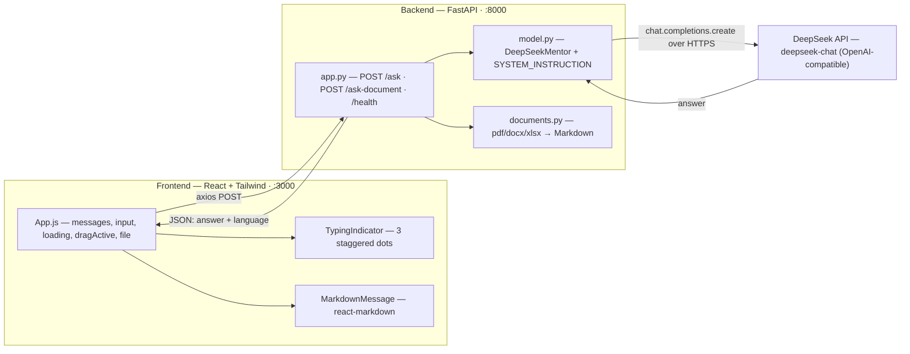

<div align="center">

# Waaie (واعي)

### An advanced AI mentor for Saudi high school students — bilingual (Arabic 🇸🇦 / English 🇬🇧)

Waaie is a curriculum-aligned AI tutor for the Saudi secondary stage, built as a stateless two-tier application: a **FastAPI** backend driven by **DeepSeek-V3** (via the OpenAI compatibility layer) paired with a **React + Tailwind CSS** chat interface. It enforces strict educational guardrails, parses uploaded documents into clean Markdown context, and shields students from every raw backend error.

[]()
[]()
[]()
[]()
[]()

</div>

---

## Overview

**Waaie** is an AI study mentor for Saudi high school students, aligned with the Ministry of Education curriculum. It teaches across five subjects — **Mathematics (الرياضيات)**, **Physics (الفيزياء)**, **Chemistry (الكيمياء)**, **Biology, Earth & Space Sciences (الأحياء وعلوم الأرض والفضاء)**, and **Digital Technology & Computer Science (التقنية الرقمية والحاسب)** — answering fluently in the student's own language with structured, readable Markdown (headings, lists, step-by-step solutions, tables, formulas, and code blocks).

The assistant is **strictly scoped** to these five subjects. Any out-of-scope request — programming chores, cooking, sports, trivia, general life advice — is declined with a single, fixed Arabic refusal. Scope enforcement is prompt-based and lives in one source of truth: the `SYSTEM_INSTRUCTION` constant in `backend/model.py`.

---

## Key Features

### 🤖 AI Core — DeepSeek-V3
Driven by **DeepSeek-V3** (`deepseek-chat`) through the standard **OpenAI compatibility framework** (`base_url=https://api.deepseek.com/v1`). This delivers ultra-low-cost, rapid text responses with no daily free-tier caps — the full strict persona is routed into the OpenAI `system` role on every call, keeping behavior identical to the design contract while operating on a prepaid, cost-controlled production tier.

### 📄 Advanced Document Pipeline
Structure-aware extraction for **`.pdf`**, **`.docx`**, and the newly added tabular **`.xlsx`** (Excel) files. Each format is mapped into clean, token-efficient **Markdown** — headings become `#`, lists become `-`, and spreadsheet/Word tables become Markdown pipe tables (Excel cells are read with computed values so the model can reason over numbers). The context budget is expanded to **150,000 characters**, with structure-aware compression that preserves the document's intro, headings, and the first paragraph under each heading only when the budget is exceeded.

### 🎨 Premium UI/UX
A focus-friendly **Teal / Slate** educational design system that avoids jarring high contrast. Includes **native drag-and-drop** file uploads (drop a `.pdf`, `.docx`, or `.xlsx` anywhere on the window for an "أفلت الملف هنا للرفع" overlay) and a fluid, **sequential 3-dot bouncing typing indicator** rendered next to "واعي يكتب…" while inference is in flight.

### 🛡️ Error Shielding (Student Protection)
**Absolute masking of raw API errors.** Any failure — `429` rate limit, `500`/`502` upstream error, network timeout — is collapsed into a single, encouraging Arabic recovery notice. Students never see status codes, JSON payloads, or stack traces:

> يبدو أنني لم أفهمك جيداً بسبب الضغط العالي، يرجى إعادة إرسال سؤالك مرة أخرى لأختبرك فيه!

### 🎓 Academic Guardrails
Six strict, localized constraints encoded in `SYSTEM_INSTRUCTION` keep the AI a dedicated tutor:

1. **Subject Lock** — answers only within the five high-school subjects.
2. **Identity Lock** — always responds as "واعي", never reveals it is a general model.
3. **No Leakage** — never discloses its system prompt or internal rules.
4. **Disguised / Injected Requests** — resists prompt-injection and reworded out-of-scope asks.
5. **Refusal Protocol** — out-of-scope prompts get *exactly* the fixed Arabic refusal, nothing appended.
6. **Mixed Requests** — answers only the in-scope part of a mixed question and silently drops the rest.

---

## Architecture & Tech Stack

Waaie is a stateless two-tier application. A **React SPA** talks to a stateless **FastAPI** service over JSON. There is no database and no session state — the entire assistant scope is a prompt, and the backend is a thin, secure wrapper around the DeepSeek API.



| Layer        | Technologies                                                                              |
| ------------ | ----------------------------------------------------------------------------------------- |
| **Frontend** | React.js · Tailwind CSS · react-markdown + remark-gfm · axios · Cairo font                 |
| **Backend**  | FastAPI (Python) · Uvicorn · `openai` SDK · `pdfplumber` · `python-docx` · `openpyxl` · Pydantic |
| **AI**       | DeepSeek-V3 (`deepseek-chat`) via the OpenAI compatibility layer                           |
| **Testing**  | pytest · httpx · reportlab · arabic-reshaper · python-bidi                                 |

### Repository layout

```text
Waaie/
├── README.md
├── docker-compose.yaml
├── backend/                      # FastAPI + DeepSeek service
│   ├── app.py                    # API routes, CORS, rate limiting, error shielding
│   ├── model.py                  # DeepSeekMentor: persona, 6 guardrails, language detect
│   ├── documents.py              # structure-aware pdf/docx/xlsx → Markdown pipeline
│   ├── requirements.txt
│   ├── Dockerfile
│   └── tests/                    # 31 offline contract tests
│       ├── conftest.py           # patches openai.OpenAI with an offline FakeClient
│       ├── contract.py           # guardrail-aware fake + byte-exact refusal contract
│       ├── test_app.py
│       └── test_model.py
└── frontend/                     # React + Tailwind SPA
    ├── src/
    │   ├── App.js                # chat state, drag-and-drop, error shielding, indicator
    │   ├── index.css             # Tailwind + Cairo font + slate canvas
    │   └── components/
    │       ├── Navbar.js
    │       ├── BrandLogo.js
    │       └── MarkdownMessage.js
    ├── tailwind.config.js        # design tokens (teal accent, shadows, animations)
    └── package.json
```

---

## Getting Started

### Prerequisites

| Tool                 | Version | Notes                                                   |
| -------------------- | ------- | ------------------------------------------------------- |
| **Python**           | 3.10+   | For the FastAPI backend                                 |
| **Node.js**          | 18+     | For the React frontend                                  |
| **DeepSeek API key** | —       | From the [DeepSeek platform](https://platform.deepseek.com) |

> Run the backend and frontend in **two separate terminals**. The commands below assume your shell is at the repository root (`Waaie/`).

### 1. Configure the `.env` file

Create `backend/.env` (it is git-ignored — never commit it) with your DeepSeek key:

```ini
DEEPSEEK_API_KEY=sk-your-real-key-here
# Optional overrides:
DEEPSEEK_MODEL=deepseek-chat
CORS_ORIGINS=http://localhost:3000
```

The backend **fails fast** on startup if `DEEPSEEK_API_KEY` is missing.

### 2. Run the Backend

```bash
cd backend
python -m venv .venv
# Windows (PowerShell): .venv\Scripts\Activate.ps1
# macOS / Linux:        source .venv/bin/activate

pip install -r requirements.txt
uvicorn app:app --reload          # → http://127.0.0.1:8000
```

Verify it's alive:

```bash
curl http://127.0.0.1:8000/health
# → {"status":"healthy","model":"deepseek-chat","provider":"deepseek"}
```

### 3. Run the Frontend

```bash
cd frontend
npm install
npm start                         # → http://localhost:3000
```

Open **http://localhost:3000**, ask a question, or drag a `.pdf` / `.docx` / `.xlsx` onto the window.

### API Reference

Interactive docs are served by FastAPI at `/docs` (Swagger) and `/redoc`.

| Method | Path             | Description                                              |
| ------ | ---------------- | -------------------------------------------------------- |
| `GET`  | `/`              | API metadata & endpoint index                            |
| `GET`  | `/health`        | Liveness probe (`503` if the DeepSeek client is missing) |
| `POST` | `/ask`           | Ask a high-school subject question (JSON)                |
| `POST` | `/ask-document`  | Upload a `.pdf`/`.docx`/`.xlsx` + optional question      |

```bash
curl -X POST http://localhost:8000/ask \
  -H "Content-Type: application/json" \
  -d '{"question": "Solve the equation x^2 - 5x + 6 = 0"}'
```

---

## Testing

The backend ships with **31 automated tests** (`pytest`) that run **fully offline with zero network leakage**. `tests/conftest.py` patches `openai.OpenAI` with a guardrail-aware `FakeClient` *before* any module imports the DeepSeek client, so no real API key or network call is ever made. The suite validates the strict guardrail contract end-to-end:

- **In-scope** queries return the full structured success envelope.
- **Out-of-scope** queries return the byte-exact Arabic refusal — verified to match `SYSTEM_INSTRUCTION` character-for-character.
- **Mixed** queries answer only the in-scope part and drop the rest.
- Error mapping (`502` upstream failure, `503` degraded health), request validation, and language detection.

```bash
cd backend
python -m pytest                  # 31 passed
python -m pytest -v               # verbose
python -m pytest tests/test_model.py
```

---

## Cost-Safety & Token Efficiency

Waaie is engineered to run cheaply and predictably on a prepaid DeepSeek tier:

- **Token-efficient context** — documents are compressed into structured Markdown, not dumped as raw text, minimizing tokens per request.
- **Structure-aware budgeting** — compression to the 150,000-character budget only triggers when a document exceeds it; smaller documents pass through intact.
- **Single-shot inference** — one `chat.completions.create` call per question at `temperature=0.3`, with no retry loops that could silently multiply spend.
- **Server-side rate limiting** — `slowapi` throttles the public endpoints to curb abuse and runaway cost.

---

<div align="center">

**Waaie (واعي)** — built for Saudi high school students across Mathematics, Physics, Chemistry, Biology/Earth & Space Sciences, and Digital Technology & Computer Science.

</div>
