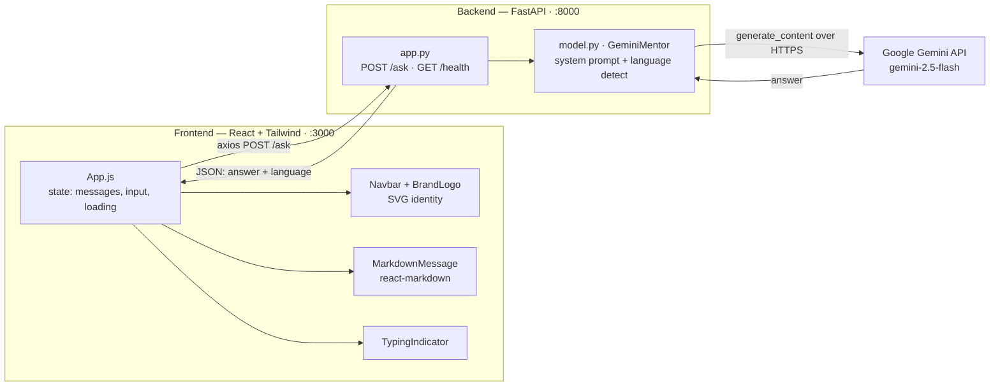
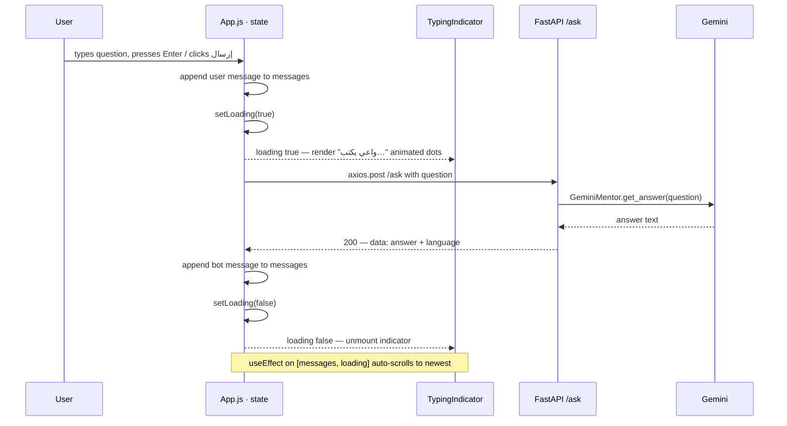
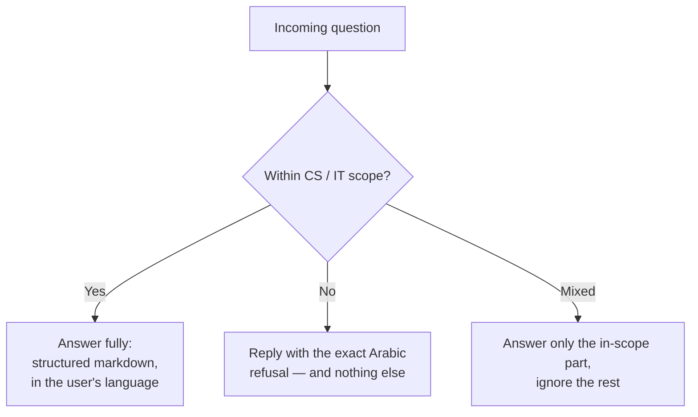

<div align="center">

# Waaie (واعي)

### An AI-powered IT & Cybersecurity tutor — bilingual (Arabic 🇸🇦 / English 🇬🇧)

A **FastAPI** backend powered by **Google Gemini** paired with a **React + Tailwind CSS** chat interface, featuring a refined dark-mode editorial design, strict domain guardrails, and live markdown rendering.

[]()
[]()
[]()
[]()
[]()

</div>

---

## Table of Contents

- [Overview](#overview)
- [Architecture](#architecture)
  - [High-level map](#high-level-map)
  - [Request lifecycle: how `TypingIndicator` interacts with the API](#request-lifecycle-how-typingindicator-interacts-with-the-api)
  - [Repository layout](#repository-layout)
- [AI Guardrails & Scope](#ai-guardrails--scope)
- [Installation & Setup](#installation--setup)
  - [Prerequisites](#prerequisites)
  - [1. Backend (FastAPI + Gemini)](#1-backend-fastapi--gemini)
  - [2. Frontend (React + Tailwind)](#2-frontend-react--tailwind)
- [Environment Variables](#environment-variables)
- [API Reference](#api-reference)
- [Testing](#testing)
- [Production & Deployment](#production--deployment)
- [Security](#security)
- [Tech Stack](#tech-stack)

---

## Overview

**Waaie** explains computing concepts — hardware, operating systems, networking (OSI, protocols, ports), and cybersecurity fundamentals (CIA triad, malware, phishing) — to learners from absolute beginners to intermediate. It answers fluently in **the same language the student uses** and renders structured, readable responses with headings, bullet lists, tables, and code blocks.

> [!NOTE]
> The assistant is **strictly scoped** to Computer Science & IT. Off-topic questions (cooking, history, pure math, etc.) are politely declined in Arabic. See [AI Guardrails & Scope](#ai-guardrails--scope).

**Key features**

| Area           | Highlights                                                                        |
| -------------- | --------------------------------------------------------------------------------- |
| 🤖 AI          | Google Gemini (`gemini-2.5-flash`) via the official `google-genai` SDK            |
| 🛡️ Guardrails  | System-prompt enforced CS/IT-only scope with an exact Arabic refusal message      |
| 🌐 Bilingual   | Automatic Arabic/English detection; replies in the user's language                |
| 🎨 UI          | Refined dark-mode editorial layout, RTL-aware, custom SVG brand identity          |
| ✍️ Rendering   | Live markdown (`react-markdown` + `remark-gfm`) with custom typography            |
| ⏳ UX          | Animated "واعي يكتب…" typing indicator during inference                           |
| ⚡ Performance | Memoized chat components — markdown is parsed once per message, not per keystroke |

---

## Architecture

Waaie is a two-tier application: a stateless **React SPA** talks to a stateless **FastAPI** service over a single JSON endpoint (`POST /ask`). The backend is a thin, secure wrapper around the Gemini API — no database, no session state.

### High-level map



**Frontend (`frontend/src/`)** — a single-page React 19 app built with Create React App and styled entirely with Tailwind utility classes.

| Module                          | Responsibility                                                                                                                                                                                                            |
| ------------------------------- | ------------------------------------------------------------------------------------------------------------------------------------------------------------------------------------------------------------------------- |
| `App.js`                        | Root component. Owns all state (`messages`, `input`, `loading`), the `axios` call, auto-scroll, and the composer. Hosts memoized presentational sub-components: `SendIcon`, `TypingIndicator`, `UserBubble`, `BotBubble`. |
| `components/Navbar.js`          | Frosted-glass sticky header (`backdrop-blur-md bg-zinc-950/70`) hosting the logo + brand name.                                                                                                                            |
| `components/BrandLogo.js`       | Inline, responsive SVG mark — a security shield fused with a terminal `>_` prompt; silver/zinc gradient with an amber cyber-accent. IDs namespaced via `useId()`.                                                         |
| `components/MarkdownMessage.js` | Renders Gemini's markdown with custom editorial components (sectioned headings, custom bullets, code surfaces, tables). Wrapped in `React.memo`.                                                                          |

**Backend (`backend/`)**

| Module     | Responsibility                                                                                                                                                                                          |
| ---------- | ------------------------------------------------------------------------------------------------------------------------------------------------------------------------------------------------------- |
| `app.py`   | FastAPI app: CORS, request/response models, and the `/`, `POST /ask`, `GET /ask` (405), `/health` routes. Maps errors to clean HTTP codes.                                                              |
| `model.py` | `GeminiMentor` class — reads `GEMINI_API_KEY` from the environment, holds the `SYSTEM_INSTRUCTION` (persona + guardrails), detects language via an Arabic-script regex, and calls `generate_content()`. |

### Request lifecycle: how `TypingIndicator` interacts with the API

The typing indicator is driven purely by the `loading` boolean in `App.js`. It is a pure function of that single piece of state — it mounts when a request is in flight and unmounts the instant a response (or error) arrives.



> [!TIP]
> On failure, the `catch` block appends an error bubble (`isError: true`) and the `finally` block always calls `setLoading(false)` — so the indicator can never get "stuck", even on a network error or a backend `502`.

**State contract**

| State      | Type                                                 | Role                                                                                   |
| ---------- | ---------------------------------------------------- | -------------------------------------------------------------------------------------- |
| `messages` | `Array<{ text, sender: 'user' \| 'bot', isError? }>` | The full conversation, rendered in order.                                              |
| `input`    | `string`                                             | Controlled composer value (auto-growing textarea).                                     |
| `loading`  | `boolean`                                            | `true` while awaiting Gemini → toggles `<TypingIndicator/>` and disables the composer. |

### Repository layout

```text
Waaie/
├── README.md                     # ← you are here
├── .gitignore                    # secrets & build artifacts excluded
├── docs/
│   └── ARCHITECTURE.md           # deep technical specification
│
├── backend/                      # FastAPI + Gemini service
│   ├── app.py                    # API routes, CORS, error mapping
│   ├── model.py                  # GeminiMentor: persona, guardrails, language detect
│   ├── requirements.txt          # Python dependencies
│   ├── .env.example              # template — copy to .env (never commit .env)
│   └── tests/
│       ├── conftest.py           # offline Gemini mock (no API key needed)
│       ├── test_app.py           # endpoint tests
│       └── test_model.py         # model/unit tests
│
└── frontend/                     # React + Tailwind SPA
    ├── public/index.html
    ├── src/
    │   ├── App.js                # root component + chat state
    │   ├── index.css             # Tailwind directives + Cairo font + scrollbar
    │   └── components/
    │       ├── Navbar.js
    │       ├── BrandLogo.js
    │       └── MarkdownMessage.js
    ├── tailwind.config.js        # design tokens (accent, shadows, animations)
    ├── postcss.config.js
    ├── .env.example
    └── package.json
```

---

## AI Guardrails & Scope

The assistant's behavior is governed entirely by the `SYSTEM_INSTRUCTION` constant in **`backend/model.py`**, injected on every request via `GenerateContentConfig(system_instruction=...)`. There is no separate classifier — scope enforcement happens inside the model under a hard instruction.

### In-scope domains ✅

Programming & software engineering · algorithms & data structures · computer hardware & architecture · operating systems · computer networking · databases · DevOps & cloud · cybersecurity · artificial intelligence / machine learning.

### Out-of-scope — automatically refused ❌

Cooking · history · geography · sports · politics · medicine · general life advice · **pure mathematics** (calculus, differentiation, integration) **unless** framed directly in a CS/ML context.

### How refusal works



When a request is out of scope, the model returns **exactly** this message (no extra text):

```text
أنا هنا كمساعد ومتخصص في مجالات علوم الحاسب وتقنية المعلومات فقط.
يسعدني الإجابة على أي سؤال يخص البرمجة، الشبكات، أو الأمن السيبراني!
```

> [!IMPORTANT]
> The refusal is **always in Arabic**, by design, regardless of the input language. To change the scope or the refusal text, edit `SYSTEM_INSTRUCTION` in `backend/model.py` — it is the single source of truth for the assistant's persona and boundaries.

**Verified behavior**

| Input                        | Result                                             |
| ---------------------------- | -------------------------------------------------- |
| `What is the CIA triad?`     | ✅ Full structured cybersecurity explanation       |
| `ما الفرق بين TCP و UDP؟`    | ✅ Full answer in Arabic (with a comparison table) |
| `كيف أطبخ الكبسة؟` (cooking) | ❌ Exact Arabic refusal, nothing else              |
| `Solve ∫ x² dx` (pure math)  | ❌ Refused — not framed in a CS/ML context         |

---

## Installation & Setup

### Prerequisites

| Tool               | Version | Notes                                                                |
| ------------------ | ------- | -------------------------------------------------------------------- |
| **Python**         | 3.10+   | For the FastAPI backend                                              |
| **Node.js**        | 18+     | For the React frontend                                               |
| **Gemini API key** | —       | Free key from [Google AI Studio](https://aistudio.google.com/apikey) |

> [!NOTE]
> Run the backend and frontend in **two separate terminals**. The commands below assume your shell is at the repository root (`Waaie/`).

### 1. Backend (FastAPI + Gemini)

```bash
# 1 — enter the backend
cd backend

# 2 — create & activate a virtual environment
python -m venv .venv
#   Windows (PowerShell):
.venv\Scripts\Activate.ps1
#   macOS / Linux:
source .venv/bin/activate

# 3 — install dependencies
pip install -r requirements.txt

# 4 — configure your secret key
cp .env.example .env          # Windows: copy .env.example .env
#   then open .env and paste your real GEMINI_API_KEY

# 5 — run the API (http://127.0.0.1:8000)
uvicorn app:app --reload
```

> [!TIP]
> If `pip` / `uvicorn` aren't on your PATH, prefix them with the interpreter:
> `python -m pip install -r requirements.txt` and `python -m uvicorn app:app --reload`.

Verify it's alive:

```bash
curl http://127.0.0.1:8000/health
# → {"status":"healthy","model":"gemini-2.5-flash","provider":"gemini"}
```

### 2. Frontend (React + Tailwind)

```bash
# 1 — enter the frontend (new terminal)
cd frontend

# 2 — install dependencies (Tailwind, react-markdown, axios, …)
npm install

# 3 — (optional) point the app at a non-default backend
cp .env.example .env          # Windows: copy .env.example .env
#   default REACT_APP_BACKEND_URL is http://localhost:8000

# 4 — start the dev server (http://localhost:3000)
npm start
```

Open **http://localhost:3000** and ask a question.

---

## Environment Variables

### Backend — `backend/.env`

| Variable         | Required | Default                 | Description                                                              |
| ---------------- | :------: | ----------------------- | ------------------------------------------------------------------------ |
| `GEMINI_API_KEY` |    ✅    | —                       | Your Google AI Studio key. The app **fails fast** on startup if missing. |
| `GEMINI_MODEL`   |    ⬜    | `gemini-2.5-flash`      | Override the Gemini model.                                               |
| `CORS_ORIGINS`   |    ⬜    | `http://localhost:3000` | Comma-separated list of allowed frontend origins.                        |

### Frontend — `frontend/.env`

| Variable                | Required | Default                 | Description                      |
| ----------------------- | :------: | ----------------------- | -------------------------------- |
| `REACT_APP_BACKEND_URL` |    ⬜    | `http://localhost:8000` | Base URL of the FastAPI backend. |

---

## API Reference

Interactive docs are served automatically by FastAPI:

- **Swagger UI** → http://localhost:8000/docs
- **ReDoc** → http://localhost:8000/redoc

| Method | Path      | Description                     | Success | Errors                                      |
| ------ | --------- | ------------------------------- | ------- | ------------------------------------------- |
| `GET`  | `/`       | API metadata & endpoint index   | `200`   | —                                           |
| `GET`  | `/health` | Liveness probe                  | `200`   | `503` if the client is uninitialized        |
| `POST` | `/ask`    | Ask a CS/IT question            | `200`   | `400` empty question · `502` Gemini failure |
| `GET`  | `/ask`    | Guard — returns a helpful `405` | —       | `405` Method Not Allowed                    |

**Request**

```bash
curl -X POST http://localhost:8000/ask \
  -H "Content-Type: application/json" \
  -d '{"question": "What is the CIA triad in cybersecurity?"}'
```

**Response** `200 OK`

```jsonc
{
  "status": "success",
  "message": "Answer generated",
  "data": {
    "answer": "## The CIA Triad\n\n- **Confidentiality** …", // markdown
    "language": "en", // 'en' | 'ar'
  },
}
```

**Error** `502 Bad Gateway` (upstream Gemini issue)

```jsonc
{ "detail": "Gemini request failed: <reason>" }
```

---

## Testing

The backend test suite runs **fully offline** — `tests/conftest.py` monkeypatches the Gemini client, so no API key or network is required.

```bash
cd backend
pytest                 # run everything
pytest tests/test_model.py     # a single file
pytest -v              # verbose
```

| Test file       | Covers                                                                                                     |
| --------------- | ---------------------------------------------------------------------------------------------------------- |
| `test_app.py`   | `/health`, `/ask` success (EN & AR), empty-question `400`, `GET /ask` `405`, invalid payload `422`         |
| `test_model.py` | `GeminiMentor` init, language detection, answer shape, empty/whitespace guards, missing-key `RuntimeError` |

Frontend:

```bash
cd frontend
npm test               # React Testing Library (watch mode)
npm run build          # production build — must compile clean
```

---

## Production & Deployment

> [!WARNING]
> The following are **production blockers** to address before a public deployment:

- [ ] **Restrict CORS** — set `CORS_ORIGINS` to your real frontend domain(s), never `*`.
- [ ] **Rotate & vault the API key** — inject `GEMINI_API_KEY` via your platform's secret manager, not a committed file.
- [ ] **Rate limiting** — add a reverse-proxy or middleware throttle in front of `/ask` to control Gemini cost/abuse.
- [ ] **Serve over HTTPS/TLS** — Gemini traffic is already TLS-encrypted in transit; terminate TLS at your edge for the public API too.

**Build the frontend for production**

```bash
cd frontend
npm run build          # outputs an optimized static bundle to frontend/build/
```

Serve `frontend/build/` from any static host (Nginx, Vercel, Netlify, S3+CloudFront) and run the backend with a production ASGI server:

```bash
cd backend
uvicorn app:app --host 0.0.0.0 --port 8000   # add --workers N behind a process manager
```

---

## Security

- 🔑 **No hardcoded secrets** — `GEMINI_API_KEY` is read exclusively from the environment; `model.py` raises immediately if it's unset.
- 🚫 **`.env` is git-ignored** — only `.env.example` placeholders are tracked.
- 🔒 **TLS by default** — all Gemini API calls go over HTTPS.
- 🧱 **Scoped CORS** — origins are explicit and configurable, not wildcarded.
- 🛡️ **Domain guardrails** — the system prompt prevents the assistant from being used as a general-purpose chatbot.

---

## Tech Stack

| Layer        | Technologies                                                                                    |
| ------------ | ----------------------------------------------------------------------------------------------- |
| **Frontend** | React 19 · Create React App · Tailwind CSS 3 · react-markdown + remark-gfm · axios · Cairo font |
| **Backend**  | Python · FastAPI · Uvicorn · google-genai SDK · python-dotenv · Pydantic v2                     |
| **AI**       | Google Gemini `gemini-2.5-flash`                                                                |
| **Testing**  | pytest · httpx · React Testing Library                                                          |

---

<div align="center">

**Waaie (واعي)** — built for learners of Computer Science & Information Technology.

For the full technical specification, see [`docs/ARCHITECTURE.md`](docs/ARCHITECTURE.md).

</div>
