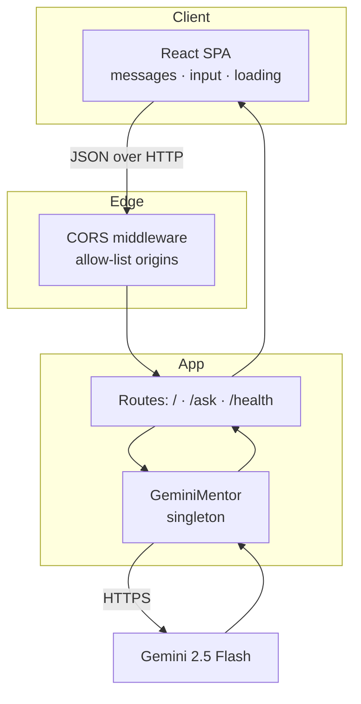
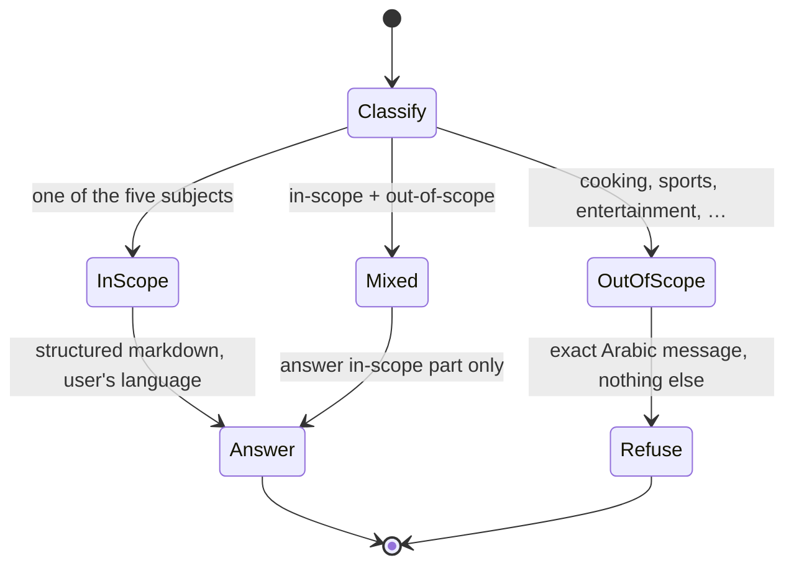
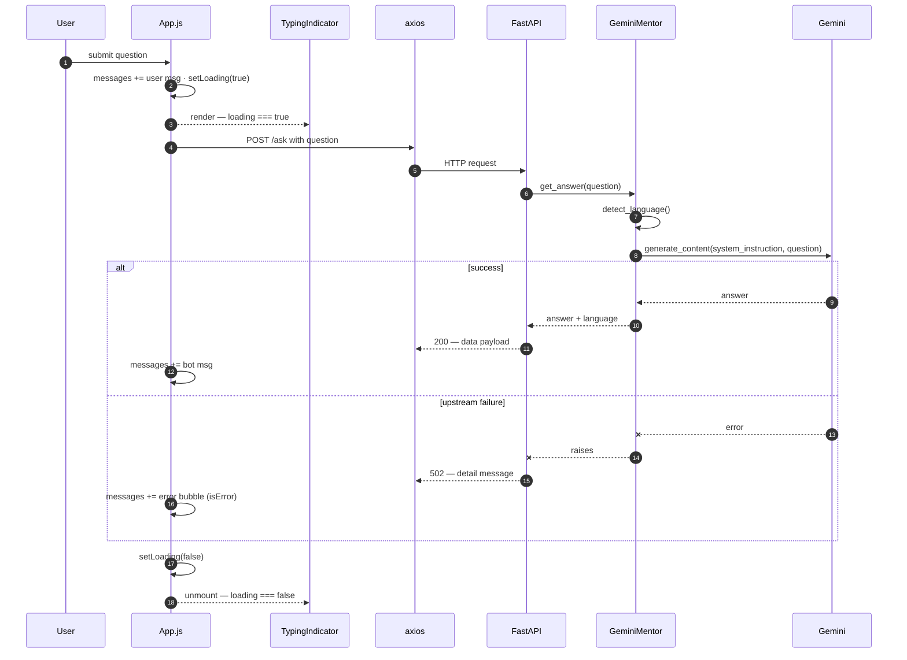

# Waaie (واعي) — Technical Architecture Specification

> A detailed companion to the [root README](../README.md). This document specifies the system design, data contracts, component responsibilities, and the runtime behavior of the chat loop and AI guardrails.

---

## 1. System Design

Waaie is a **stateless two-tier application**:

| Tier | Runtime | Statefulness |
|---|---|---|
| Presentation | React 19 SPA (CRA) on port `3000` | Conversation state held in-memory in the browser only |
| Application | FastAPI (Uvicorn) on port `8000` | Stateless — no DB, no sessions; one process-wide Gemini client |
| External | Google Gemini API | Managed by Google; reached over HTTPS |

There is **no database and no server-side session**. Each `POST /ask` is fully independent: the backend receives a question, asks Gemini under a fixed system prompt, and returns the answer. Conversation history lives only in the React `messages` array and is lost on refresh — an intentional simplification for a single-turn tutor.



---

## 2. Backend Specification (`backend/`)

### 2.1 `model.py` — `GeminiMentor`

The domain core. A thin, secure wrapper over the `google-genai` SDK.

| Member | Description |
|---|---|
| `DEFAULT_MODEL` | `"gemini-2.5-flash"` — overridable via `GEMINI_MODEL`. |
| `SYSTEM_INSTRUCTION` | The full persona + guardrail prompt (see §4). Injected on every call. |
| `_ARABIC_RE` | Compiled regex matching Arabic Unicode blocks for language detection. |
| `detect_language(text)` | Returns `"ar"` if any Arabic script is present, else `"en"`. |
| `GeminiMentor.__init__` | Reads `GEMINI_API_KEY` from the environment; **raises `RuntimeError` if absent** (fail-fast). Constructs the `genai.Client`. |
| `GeminiMentor.get_answer(question)` | Validates input (raises `ValueError` on empty), detects language, calls `generate_content()` with the system instruction, returns `{ "answer": str, "language": str }`. Raises `RuntimeError` on an empty model response. |

**Authentication note.** The new Google AI Studio keys (prefix `AQ.`) authenticate via the SDK's default `x-goog-api-key` header. This is handled entirely by `genai.Client(api_key=...)`; the key is never logged or echoed.

### 2.2 `app.py` — FastAPI surface

| Route | Method | Behavior | Status codes |
|---|---|---|---|
| `/` | GET | Returns API metadata and an endpoint index | `200` |
| `/health` | GET | Asserts the Gemini client is initialized | `200` / `503` |
| `/ask` | POST | Validates body → `mentor.get_answer()` → wraps result | `200` / `400` / `502` |
| `/ask` | GET | Explicit guard with a helpful message | `405` |

**Error mapping** (in `POST /ask`):

| Raised by `model.py` | HTTP response |
|---|---|
| `ValueError` (empty question) | `400 Bad Request` |
| Any other `Exception` (Gemini/network) | `502 Bad Gateway`, `{"detail": "Gemini request failed: …"}` |

**Request/response models** use Pydantic v2 (`model_config` dict). CORS origins are parsed from the comma-separated `CORS_ORIGINS` env var at startup.

### 2.3 Data contract

```jsonc
// POST /ask — request
{ "question": "string (non-empty)" }

// 200 OK — response
{
  "status":  "success",
  "message": "Answer generated",
  "data": {
    "answer":   "string (markdown)",
    "language": "en | ar"
  }
}
```

---

## 3. Frontend Specification (`frontend/src/`)

### 3.1 Component tree

```text
App  (state owner: messages, input, loading)
├── Navbar
│   └── BrandLogo            (inline SVG, useId-namespaced gradients)
├── <main> conversation
│   ├── Empty state          (BrandLogo hero + suggestion chips)
│   ├── UserBubble    × N    (React.memo)
│   ├── BotBubble     × N    (React.memo)
│   │   └── MarkdownMessage  (React.memo · react-markdown + remark-gfm)
│   └── TypingIndicator      (React.memo · shown while loading)
└── <footer> composer
    ├── auto-growing <textarea>
    └── SendIcon button       (React.memo)
```

### 3.2 Rendering & performance

- **Markdown** is rendered by `MarkdownMessage` with a custom `components` map: sectioned `h1–h3`, accent-barred headings, custom square bullets, `marker`-styled ordered lists, LTR-forced inline/block code surfaces, and styled GFM tables.
- **Memoization.** All presentational components are wrapped in `React.memo`. Because their props are primitives (`text`, `isError`), typing in the composer (which updates `input` on every keystroke and re-renders `App`) does **not** re-render existing bubbles or re-parse their markdown. Markdown is parsed **once per message**.
- **Auto-scroll.** A `useEffect` keyed on `[messages, loading]` scrolls the conversation container to the newest content.

### 3.3 Design tokens (`tailwind.config.js`)

| Token | Value | Usage |
|---|---|---|
| `colors.accent` | `#e0a86b` (+`soft`/`deep`) | Brand amber accent |
| `boxShadow.panel` | `0 4px 24px rgba(0,0,0,.45)` | Structural elevation (bubbles, composer) |
| `boxShadow.glow` | `0 0 20px rgba(0,0,0,.6)` | Micro-glow |
| `animation.fade-in-up` | staggered entrance | Message reveal |
| `animation.glow-ring` | focus pulse | Composer focus state |
| `fontFamily.cairo` | Cairo | Arabic-optimized body font |

**Radius system (uniform):** `rounded-2xl` for structural containers · `rounded-xl` for inner controls · `rounded-full` for pills/chips.

---

## 4. AI Guardrails — Detailed Specification

### 4.1 Mechanism

Scope enforcement is **prompt-based**, not a separate classifier. The `SYSTEM_INSTRUCTION` is passed to Gemini on every request via:

```python
config=types.GenerateContentConfig(system_instruction=SYSTEM_INSTRUCTION)
```

This keeps the architecture simple and avoids a second model hop, at the cost of relying on the model's instruction-following. The prompt is the single source of truth for both **persona** and **boundaries**.

### 4.2 Decision logic encoded in the prompt



### 4.3 Exact refusal contract

Out-of-scope inputs yield **only** this string (no preamble, no translation):

```text
أنا واعي، مساعدك الدراسي المخصّص حصريًا لمواد المرحلة الثانوية في المملكة العربية السعودية: الرياضيات، الفيزياء، الكيمياء، الأحياء وعلوم الأرض والفضاء، والتقنية الرقمية والحاسب. لا يمكنني مساعدتك في هذا الطلب لأنه خارج نطاق هذه المواد، لكن يسعدني الإجابة عن أي سؤال ضمنها.
```

### 4.4 Edge cases

| Case | Expected behavior |
|---|---|
| Calculus / integration (e.g. "∫ x² dx") | ✅ Answered — Mathematics is in scope |
| Physics word problem (e.g. "Newton's second law") | ✅ Answered with step-by-step reasoning |
| Mixed ("explain TCP and also a pasta recipe") | ✅ Answers TCP only, ignores the recipe |
| English out-of-scope question | ❌ Refused **in Arabic** (refusal language is fixed) |

---

## 5. Runtime Flow — End to End



> The `finally` block in `handleSendMessage` guarantees `setLoading(false)` on every path, so the `TypingIndicator` is always torn down — there is no state in which it can hang indefinitely.

---

## 6. Extension Points

| Want to… | Change |
|---|---|
| Adjust persona / scope | `SYSTEM_INSTRUCTION` in `backend/model.py` |
| Swap the model | `GEMINI_MODEL` env var (or `DEFAULT_MODEL`) |
| Add multi-turn memory | Pass prior `messages` as `contents` history to `generate_content` |
| Stream responses | Switch to `generate_content_stream` + Server-Sent Events; drive the indicator off the stream's first token |
| Restyle | Tailwind tokens in `tailwind.config.js` + component classes |

---

## 7. Testing & Verification Metrics

The suite runs **fully offline** — `backend/tests/conftest.py` patches `genai.Client`
with the guardrail-aware stub in `backend/tests/contract.py`, which emulates the
scope contract from `SYSTEM_INSTRUCTION` deterministically. No API key, no network.

```bash
# Backend — pytest + httpx (FastAPI TestClient)
cd backend && python -m pytest --cov=app --cov=model --cov-report=term-missing

# Frontend — React Testing Library (CI / non-watch)
cd frontend && set CI=true && npx react-scripts test --watchAll=false
```

### 7.1 Suite summary

| Suite | Runner | Tests | Result | Coverage |
|---|---|---|---|---|
| `backend/tests/test_model.py` | pytest | 14 | ✅ pass | `model.py` **100 %** (26/26 stmts) |
| `backend/tests/test_app.py` | pytest + httpx | 16 | ✅ pass | `app.py` **100 %** (35/35 stmts) |
| `frontend/src/App.test.js` | RTL + Jest | 4 | ✅ pass | UI state engine (loading / TypingIndicator) |
| **Total** | — | **34** | ✅ **all green** | backend lines **61/61 = 100 %** |

### 7.2 Guardrail criteria — 100 % execution paths

Every guardrail branch is exercised at **both** the model layer and the HTTP layer:

| # | Scenario | Example input | Expected | Model test | HTTP test |
|---|---|---|---|---|---|
| a | **In-scope** | `Solve the equation x^2 - 5x + 6 = 0` | `200` + `{answer, language:"en"}`, non-empty, ≠ refusal | `test_scenario_a_in_scope_query` | `test_scenario_a_in_scope_returns_200_and_structure` |
| b | **Out-of-scope** | `كيف أطبخ الكبسة؟` · `recipe for pasta` · `من فاز في مباراة كرة القدم؟` | `200` + body is **exactly** the Arabic refusal, zero extra text | `test_scenario_b_out_of_scope_exact_refusal` | `test_scenario_b_out_of_scope_exact_arabic_refusal` |
| c | **Mixed** | `Explain TCP/IP and give me a pasta recipe` | `200`, answers TCP/IP only — `pasta`/`recipe` absent | `test_scenario_c_mixed_query_filters_out_of_scope` | `test_scenario_c_mixed_query_answers_in_scope_only` |

> [!NOTE]
> Scenario **b** is parametrized over three inputs (Arabic cooking, English cooking, sports) and asserts an **exact** string match — proving the refusal carries *no* preamble or translation and stays Arabic even for an English prompt. A cross-check (`test_refusal_string_matches_system_prompt`) asserts the stub's refusal byte-matches `SYSTEM_INSTRUCTION`, so the contract can't silently drift.

### 7.3 Route coverage distribution

| Route | Method | Status paths tested | Covering tests |
|---|---|---|---|
| `/` | GET | `200` | `test_root_index` |
| `/health` | GET | `200` · `503` | `test_health_check` · `test_health_unhealthy_maps_to_503` |
| `/ask` | POST | `200` · `400` · `422` · `502` | success/Arabic/scenarios · `test_empty_question` · `test_invalid_input` · `test_upstream_failure_maps_to_502` |
| `/ask` | GET | `405` | `test_ask_get_not_allowed` |

Every status code the API can emit has at least one test; `app.py` and `model.py`
report **0 missed lines**.

### 7.4 Latency safety profile

There is no database and no server-side session, so per-route latency is governed
entirely by whether the request makes the single Gemini network hop.

| Route | Upstream hop? | Latency determinant | Failure-safety |
|---|---|---|---|
| `GET /` | No | In-memory dict — effectively constant-time | Cannot fail |
| `GET /health` | No | Asserts client handle — constant-time | Degrades to `503`, never hangs |
| `POST /ask` | **Yes** | Bounded by one `generate_content()` round-trip to Gemini | Any upstream error → `502` with `detail`; never a partial/blocking response |

**Frontend safety guarantee.** `<TypingIndicator/>` is a pure function of the
`loading` boolean. The `finally` block in `handleSendMessage` always calls
`setLoading(false)` — verified by `test('finally block unmounts the indicator
even when the request fails')`, which holds the request open, then **rejects** it
and asserts the indicator is torn down and an error bubble replaces it. The
indicator therefore cannot hang regardless of upstream latency or failure.
